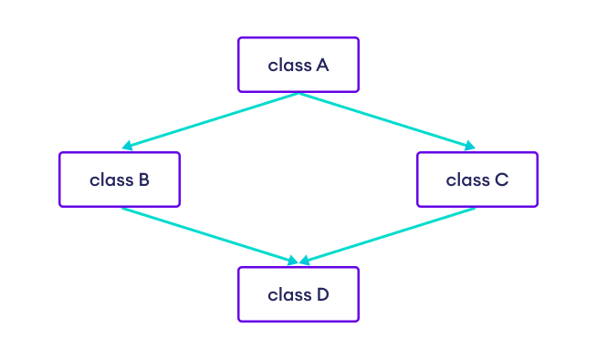

## Why is multiple inheritance not supported in java?
Java does not support multiple inheritance (a subclass has two or more superclasses) because of it's ambiguous nature.

Let's consider the following scenario.

Suppose we have class D that inherits from class B and class C. And class B and C inherits from class A which is an abstract class.

    abstract class A {
    public abstract void doSomething();
    }
------
    // inherit abstract class A
    class B extends A {
    @Override
    public void doSomething() {..}     
    }
----
    // inherit abstract class A
    class C extends A {
    @Override
    public void doSomething() {..}     
    }
----
    // inherit class B and class C
    class D extends B, C {
    // call method of superclass
    doSomething();   
    }